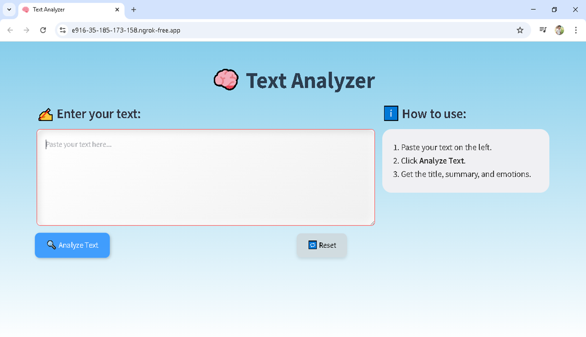
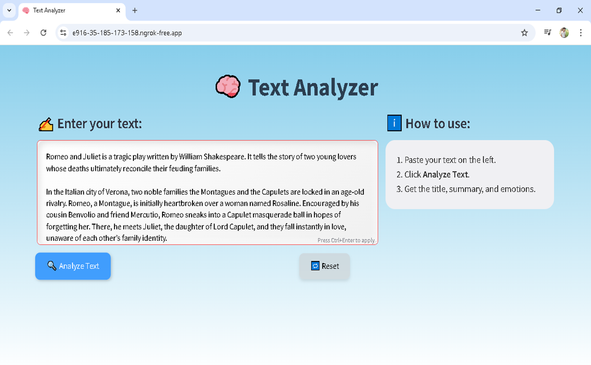
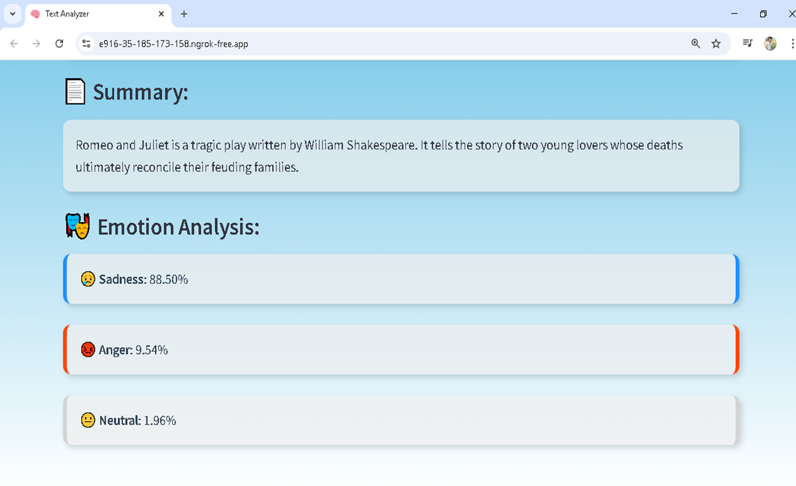
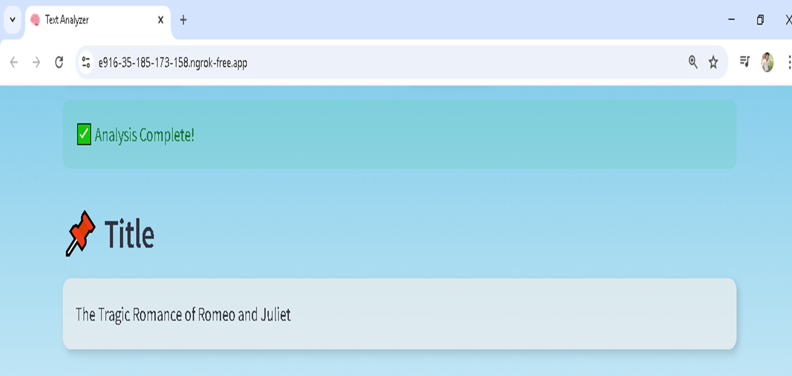

# 🧠 AI-Powered Text Analyzer

This is my final year project built using **Streamlit**, integrating:
- 📄 Text Summarization using BART
- 🎭 Emotion Detection using DistilRoBERTa
- 🏷️ Title Generation using T5

The app takes long text inputs and instantly analyzes them to generate a short summary, detect key emotions, and generate a relevant title — all in a single click.

---

## 🚀 Features
- Abstractive summarization with `facebook/bart-large-cnn`
- Emotion classification with `j-hartmann/emotion-english-distilroberta-base`
- Title generation with `mrm8488/t5-base-finetuned-summarize-news`
- Clean and animated Streamlit UI

---

## 📂 Project Files
| File | Description |
|------|-------------|
| `app.py` | Main Streamlit app |
| `Input Passages.pdf` | Sample input data |
| `AI_Text_Analyzer_Final_Presentation.pptx` | Final review PPT |
| `IJCRT2404956.pdf` | Reference paper |

---

## 🛠️ Tech Stack
- Python
- Streamlit
- HuggingFace Transformers
- NLTK

---

## 📸 Screenshots

### 🔹 Main UI – Text Analyzer


### 🔹 After Text Is Entered


### 🔹 Summarization + Emotion Detection Output


### 🔹 Title Generation Output


---

## 🔗 Try It Locally
```bash
pip install streamlit transformers nltk
streamlit run app.py

